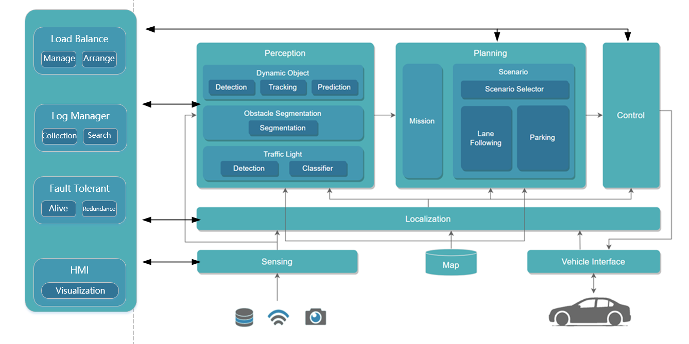
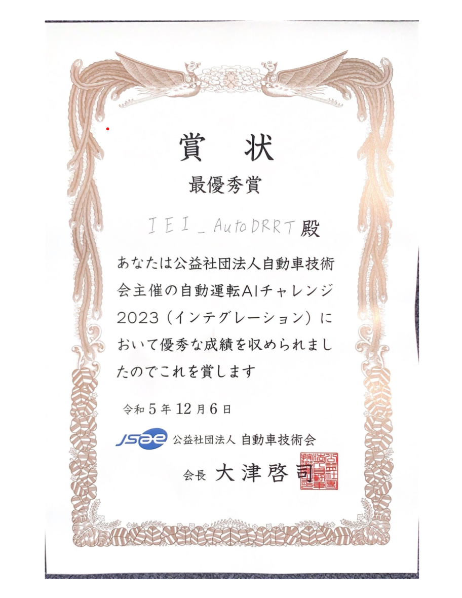
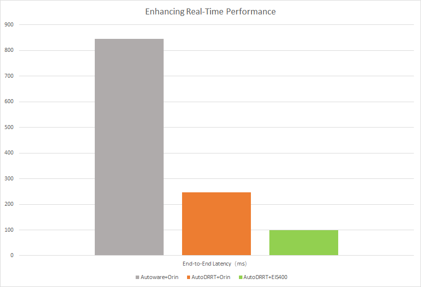

# Autonomous Driving Computing Framework AutoDRRT
AutoDRRT is an autonomous driving framework developed based on the [Autoware open-source framework](https://github.com/autowarefoundation/autoware/tree/main), with targeted optimizations for the EIS400 onboard domain controller. These optimizations enhance the framework's real-time performance, distributability, and fault tolerance. A set of tools is provided to facilitate users in making use of these new features more easily. This framework is built upon the Robot Operating System 2 (ROS2). It encompasses all necessary functionalities from localization and target detection to path planning and control, striving to lower the entry barrier and aiming to involve as many individuals and organizations as possible in the open innovation of autonomous driving technology.



Based on the AutoDRRT framework, IEI secured the dual championship in both simulation and real vehicle races at the 5th Japan Automotive AI Challenge. This solution is tailored for factory scenarios and provides a [Level 4 autonomous driving solution](../../tree/factory_scene).
<div align=center>
  
</div>


## Features

- Distributed

This framework supports transforming single-node applications into distributed applications with zero code changes.

- Enhanced Real time performance
  
  Significant Reduction in End-to-End Latency Achieved Through Multi-Faceted Optimization Strategies and Hardware-Software Co-design.
  
  <span style="font-size: small;">The test data corresponds to the 'logging_simulator' scenario used in the Autoware framework</span>


- Fault Tolerance

The framework supports concurrent startup of multiple identical algorithm nodes, capable of receiving and processing data simultaneously. In the event of a primary node failure due to faults, backup nodes seamlessly take over data transmission with millisecond-level switchover time.

- [Unmanned Car Scenario](../../tree/factory_scene)

The framework supports unmanned car scenarios, capable of addressing obstacles, smoke, S-curves, L-curves, and other situations.  It possesses safety, availability, and drivability. 


## Installation

### Target Platforms

The target platforms for AutoDRRT are as follows. There might be changes in future versions of AutoDRRT.

The AutoDRRT Foundation provides support only for the platforms listed below. Other platforms are not supported.

### Platform Architectures

- amd64

        Recommend: X86 + NVIDIA GPU (4GB RAM)

- arm64

        Recommend: NVIDIA Orin OR NVIDIA Xavier

### Recommended Platforms

- [EIS400](./docs/en/EIS400.md)

- NVIDIA Orin

### Minimum System Requirements

- 8-core CPU

- 16GB RAM

- NVIDIA GPU (4GB RAM)

### Installation Instructions

#### 1. Installation using DOCKER

 Docker ensures that all developers in the project have a consistent development environment. It is recommended for beginners, temporary users, and those unfamiliar with Ubuntu.

- [Installation Method](./docs/en/docker_Installation.md)

#### 2. Installation from SOURCE CODE

  - Environmental Requirements

    - Ubuntu 22.04

- [Installation Method](./docs/en/source_Installation.md)

### Usage Instructions

[Usage Instructions](./docs/en/tutorials.md)

If you want to use the [unmanned car scenario](../../tree/factory_scene) on the current branch, please use the following command:

```bash factory_scene.sh```


### Contact Us
[AutoDRRT@ieisystem.com](AutoDRRT@ieisystem.com)
