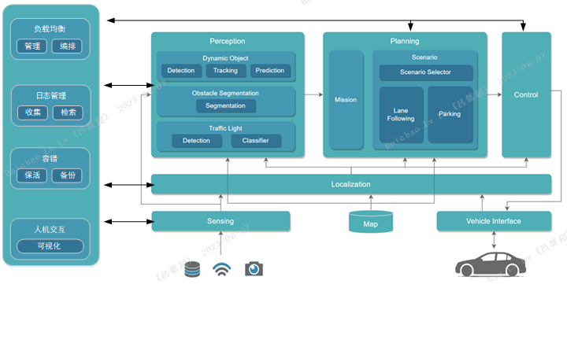

# Autonomous Driving Computing Framework AutoDRRT
AutoDRRT is an autonomous driving framework developed based on the [Autoware open-source framework](https://github.com/autowarefoundation/autoware/tree/main), with targeted optimizations for the EIS400 onboard domain controller. These optimizations enhance the framework's real-time performance, distributability, and fault tolerance. A set of tools is provided to facilitate users in making use of these new features more easily. This framework is built upon the Robot Operating System 2 (ROS2). It encompasses all necessary functionalities from localization and target detection to path planning and control, striving to lower the entry barrier and aiming to involve as many individuals and organizations as possible in the open innovation of autonomous driving technology.

## Installation

### Target Platforms

The target platforms for AutoDRRT are as follows. There might be changes in future versions of AutoDRRT.

The AutoDRRT Foundation provides support only for the platforms listed below. Other platforms are not supported.

### Platform Architectures

- amd64

        recommend: X86+NVIDIA GPU (4GB RAM)

- arm64

        recommend: NVIDIA ORIN OR NVIDIA Xavier

### Recommended Platforms

- [EIS400](./docs/en/EIS400.md)

- NVIDIA ORIN

### Minimum System Requirements

- 8-core CPU

- 16GB RAM

- NVIDIA GPU (4GB RAM)

### Installation Instructions

#### 1. Installation using DOCKER

 Docker ensures that all developers in the project have a consistent development environment. It is recommended for beginners, temporary users, and those unfamiliar with Ubuntu.

- [Installation Method](./docs/en/docker_Installation.md)

#### 2. Installation from SOURCE CODE

  - Environmental Requirements

    - Ubuntu 22.04

- [Installation Method](./docs/en/source_Installation.md)

### Usage Instructions

[Usage Instructions](./docs/en/tutorials.md)

### Contact Us
[AutoDRRT@ieisystem.com](AutoDRRT@ieisystem.com)