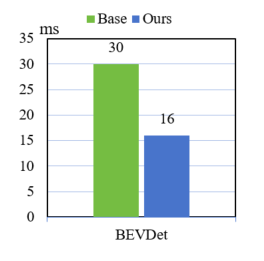
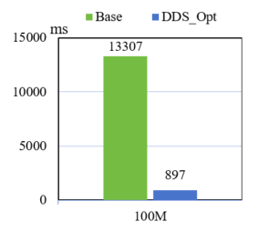
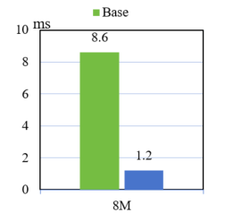

# Autonomous Driving Computing Framework AutoDRRT
AutoDRRT is an autonomous driving framework developed based on the [Autoware open-source framework](https://github.com/autowarefoundation/autoware/tree/main), with targeted optimizations for the IEI_EIS400 onboard domain controller. These optimizations enhance the framework's real-time performance, distributability, and fault tolerance. A set of tools is provided to facilitate users in making use of these new features more easily. This framework is built upon the Robot Operating System 2 (ROS2). It encompasses all necessary functionalities from localization and target detection to path planning and control, striving to lower the entry barrier and aiming to involve as many individuals and organizations as possible in the open innovation of autonomous driving technology.

## Key Updates(v2.0)

- Algorithm upgrade: integrating multiple BEV + Transformer perception algorithm libraries.
- Performance upgrade: integrating various latency optimization functions for computation, communication, and I/O.
- Usability upgrade: integrating multiple development tools and low-level drivers.

## Version Introduction

### AutoDRRT V1.0

  
  

### AutoDRRT V2.0

  
  

## Features

- Computation latency optimization
  achieving low-latency computation from 2D+CNN to BEV+Transformer
  

  
  

- Communication delay optimization
  Implementing DDS from supporting Ethernet to PCIE
  

  
  

- IO latency optimization
  GPU data sharing between nodes to avoid CPU-GPU transfer

  

  
  

## Installation

### Target Platforms

The target platforms for AutoDRRT are as follows. There might be changes in future versions of AutoDRRT.

The AutoDRRT Foundation provides support only for the platforms listed below. Other platforms are not supported.

### Platform Architectures
- arm64

        Recommend: NVIDIA Orin Jetson Linux 35.4.1

### Recommended Platforms

- [IEI_EIS400](./docs/en/EIS400.md)

- NVIDIA Orin

### Minimum System Requirements

- 8-core CPU

- 16GB RAM

- NVIDIA GPU (4GB RAM)

### Installation Instructions

 Docker ensures that all developers in the project have a consistent development environment. It is recommended for beginners, temporary users, and those unfamiliar with Ubuntu.

- [Installation Method](./docs/en/docker_Installation.md)

### Usage Instructions

[Usage Instructions](./docs/en/tutorials.md)

### Contact Us
[AutoDRRT@ieisystem.com](AutoDRRT@ieisystem.com)
