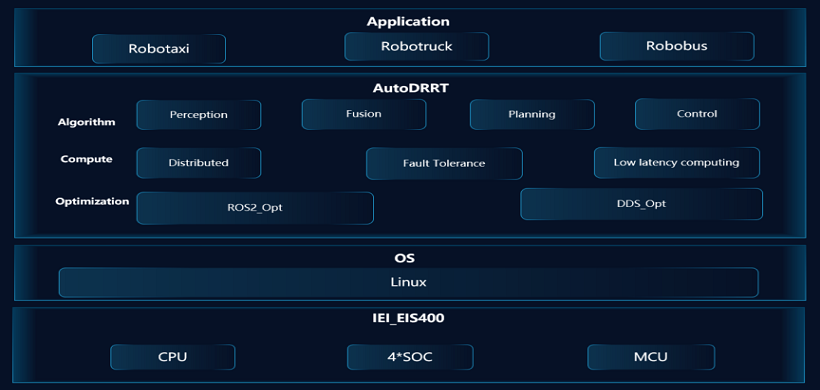
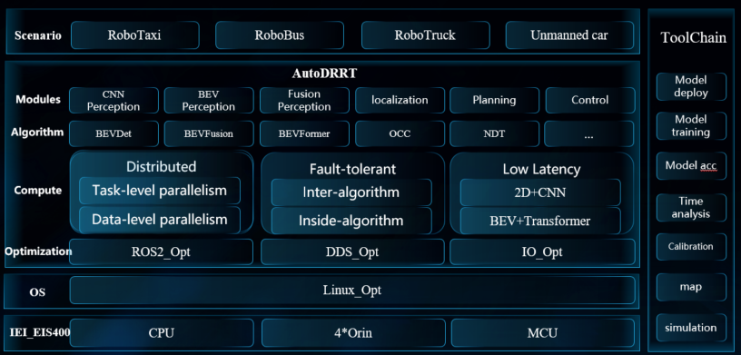
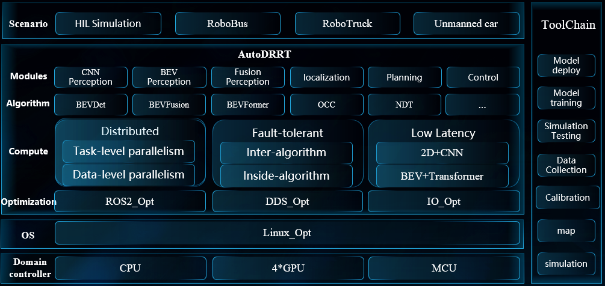
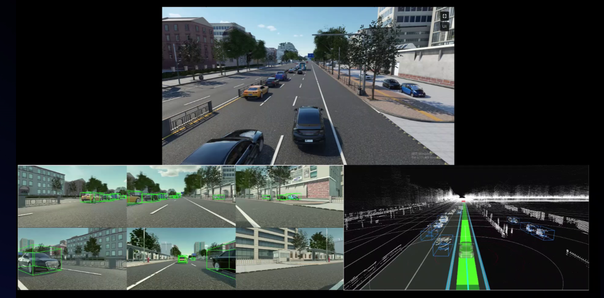
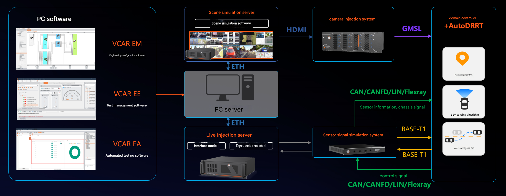

# Autonomous Driving Computing Framework AutoDRRT
AutoDRRT is an autonomous driving framework developed based on the [Autoware open-source framework](https://github.com/autowarefoundation/autoware/tree/main), with targeted optimizations for the onboard domain controller. These optimizations enhance the framework's real-time performance, distributability, and fault tolerance. A set of tools is provided to facilitate users in making use of these new features more easily. This framework is built upon the Robot Operating System 2 (ROS2). It encompasses all necessary functionalities from localization and target detection to path planning and control, striving to lower the entry barrier and aiming to involve as many individuals and organizations as possible in the open innovation of autonomous driving technology.

## Key Updates(v2.1)

- Closed-loop End-to-End Development Based on Simulation Data: Data Collection → Data Processing → Model Training → Simulation Testing → On-vehicle Validation.
- Support for Various Scenarios and Real-time Data Simulation: Corner Cases → Complex Traffic Flows → Extreme Weather → Multi-modal Real-time Sensor Data.
- Support for Simulation Testing of Diverse Algorithm Models: 2D + CNN Lightweight Models → BEV + Transformer Large Models 

## Version Introduction

### AutoDRRT V1.0

  
  

### AutoDRRT V2.0

  
  

### AutoDRRT V2.1

  
  

## Features

- BEV + Transformer Application Built upon AutoDRRT
  <!-- 

  
  
 -->

- AutoDRRT-based Advanced AD HIL Solution
  

  
  

**Interested users can access the remote testing platform Hermes+AutoDRRT for trial and testing. An account must be requested via official email.**

## Installation

### Target Platforms

The target platforms for AutoDRRT are as follows. There might be changes in future versions of AutoDRRT.

The AutoDRRT Foundation provides support only for the platforms listed below. Other platforms are not supported.

### Minimum System Requirements

- 8-core CPU

- 16GB RAM

- GPU (4GB RAM)

### Installation Instructions

 Docker ensures that all developers in the project have a consistent development environment. It is recommended for beginners, temporary users, and those unfamiliar with Ubuntu.

- [Installation Method](./docs/en/docker_Installation.md)

### Usage Instructions

[Usage Instructions](./docs/en/tutorials.md)

### Contact Us
[AutoDRRT@ieisystem.com](AutoDRRT@ieisystem.com)
