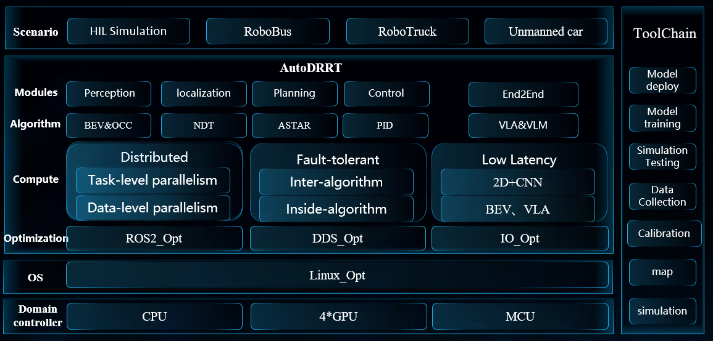
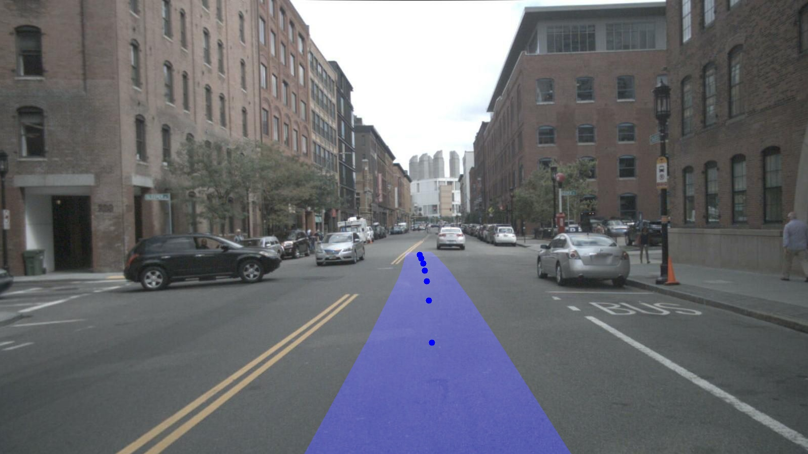
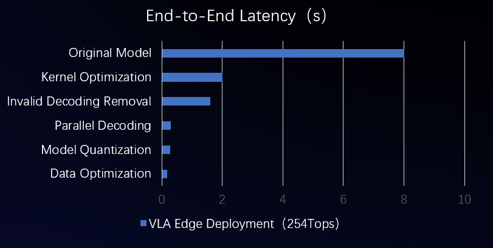

# Autonomous Driving Computing Framework AutoDRRT
AutoDRRT is an autonomous driving framework developed based on the [Autoware open-source framework](https://github.com/autowarefoundation/autoware/tree/main), with targeted optimizations for the onboard domain controller. These optimizations enhance the framework's real-time performance, distributability, and fault tolerance. A set of tools is provided to facilitate users in making use of these new features more easily. This framework is built upon the Robot Operating System 2 (ROS2). It encompasses all necessary functionalities from localization and target detection to path planning and control, striving to lower the entry barrier and aiming to involve as many individuals and organizations as possible in the open innovation of autonomous driving technology.

## Key Updates(v2.2)

- End-to-end autonomous driving framework based on vision-language-action models, with significantly improved traffic scene understanding accuracy.
- Latency optimization module and tools based on vision-language-action models, significantly reducing the end-to-end computation latency of VLA models..

## Version Introduction

### AutoDRRT V1.0

  
  

### AutoDRRT V2.0

  
  

### AutoDRRT V2.2

  
  

## Features

- VLA Model Application Built on AutoDRRT
  

  
  

<!--  -->

- VLA Model Latency Optimization Tool Built on AutoDRRT
  

  
  

## Installation

### Target Platforms

The target platforms for AutoDRRT are as follows. There might be changes in future versions of AutoDRRT.

The AutoDRRT Foundation provides support only for the platforms listed below. Other platforms are not supported.

### Minimum System Requirements

- 8-core CPU

- 16GB RAM

- GPU (4GB RAM)

### Installation Instructions

 Docker ensures that all developers in the project have a consistent development environment. It is recommended for beginners, temporary users, and those unfamiliar with Ubuntu.

- [Installation Method](./docs/en/docker_Installation.md)

### Usage Instructions

[Usage Instructions](./docs/en/tutorials.md)

### Contact Us
[AutoDRRT@ieisystem.com](AutoDRRT@ieisystem.com)
