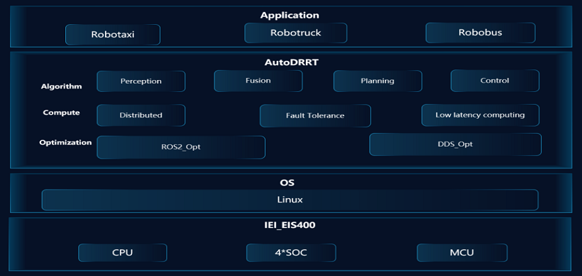
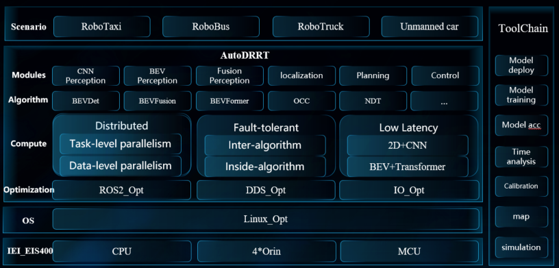
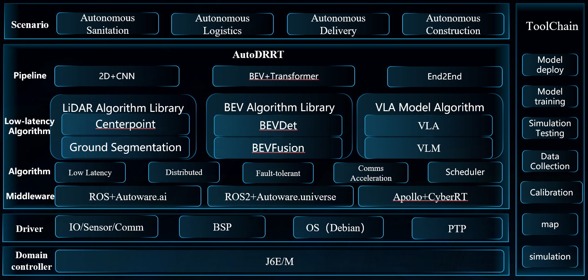
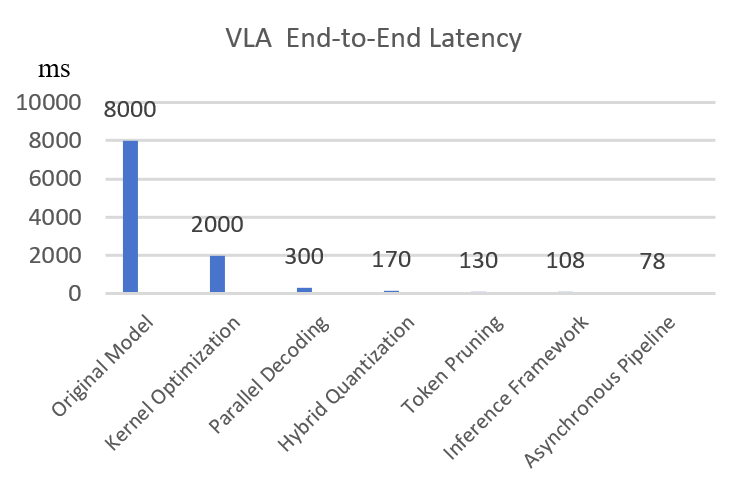
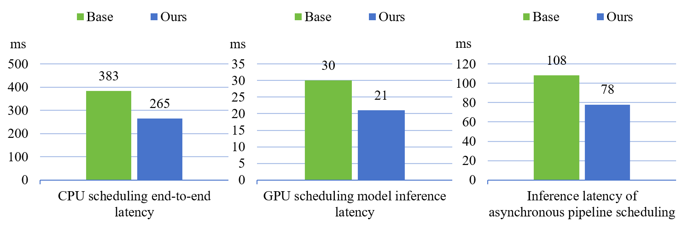
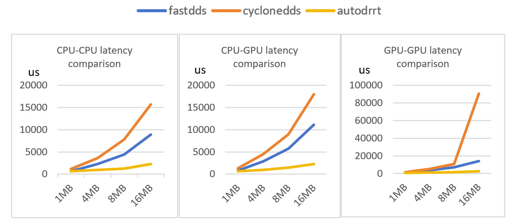

# Autonomous Driving Computing Framework AutoDRRT
AutoDRRT is an autonomous driving framework developed based on the [Autoware open-source framework](https://github.com/autowarefoundation/autoware/tree/main), with targeted optimizations for the onboard domain controller. These optimizations enhance the framework's real-time performance, distributability, and fault tolerance. A set of tools is provided to facilitate users in making use of these new features more easily. This framework is built upon the Robot Operating System 2 (ROS2). It encompasses all necessary functionalities from localization and target detection to path planning and control, striving to lower the entry barrier and aiming to involve as many individuals and organizations as possible in the open innovation of autonomous driving technology.

## Key Updates(v3.0)

- Latency optimization module and tools based on vision-language-action models, significantly reducing the end-to-end computation latency of VLA models.
- Unified heterogeneous scheduling framework for multi-compute units, achieving a dual breakthrough in task determinism and resource utilization through fine-grained orchestration of CPU, and AI accelerators.
- Reconfigured high-performance communication middleware covering all-scenario data paths, eliminating transmission bottlenecks to fully unleash the real-time response potential of VLA models.

## Version Introduction

### AutoDRRT V1.0

  
  

### AutoDRRT V2.0

  
  

### AutoDRRT V3.0

  
  

## Features

- Comparison of AutoDRRT computational optimization technology's effect on reducing inference latency for large VLA models
  

    
  

- Latency comparison under heterogeneous computing power scheduling framework
  

  
  

- Latency comparison under high-performance communication framework
  

  
  

AutoDRRT has achieved deep native support for the domestic Horizon Robotics Journey 6 (J6) platform, establishing a complete link from the heterogeneous computing power of the underlying chip to the upper-layer general software stack for autonomous vehicle scenarios. It has completed full-stack native adaptation of ROS + Autoware.ai and ROS2 + Autoware.universe, becoming the industry's first open-source autonomous driving framework adapted to this platform. Based on the J6 domain controller + AutoDRRT, customers can directly implement "out-of-the-box" solutions and quickly verify them on the J6 domain controller. For more information, please contact us via email.

## Installation

### Target Platforms

The target platforms for AutoDRRT are as follows.

The AutoDRRT provides support only for the platforms listed below. Other platforms are not supported.

### Minimum System Requirements

- 6-core CPU

- 12GB RAM

- GPU (4GB RAM)

### Installation Instructions

 Docker ensures that all developers in the project have a consistent development environment. It is recommended for beginners, temporary users, and those unfamiliar with Ubuntu.

- [Installation Method](./docs/en/docker_Installation.md)

### Usage Instructions

[Usage Instructions](./docs/en/tutorials.md)

### Contact Us
[AutoDRRT@ieisystem.com](AutoDRRT@ieisystem.com)
