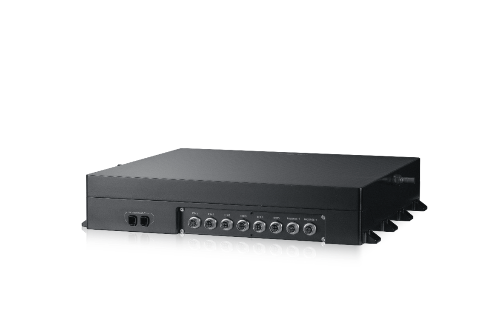

# EIS400 域控制器
EIS400是由浪潮信息针对L4自动驾驶研发的一款车载域控制器，主要计算核心包含1个x86CPU，4个NVIDIA ORIN芯片，1个MCU芯片，AI算力可达1100T.

* 系统架构

基于CPU+ 4*SOC + MCU异构分布式架构

系统内冗余架构设计，实现计算、通信、IO容错

* 计算性能

AI算力：1100Tops

CPU算力：1000DMIPS

* 散热方式

风冷/液冷

* Sensors

16*Camera/8*Lidar/10*CAN

## 如何获取

[点击这里申请使用](AutoDRRT@ieisystem.com)。
