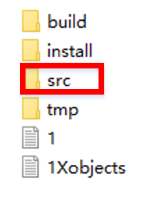
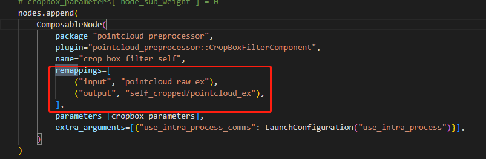

# 使用说明
## demo运行方法

1.  开启容器显示图形界面权限：打开终端，该终端记为终端A，输入xhost
    +,并回车。

2.  进入容器：docker exec --it autodrrt  /bin/bash,并回车。

3.  进入autoware目录： cd /home/orin/autoware/

4.  另开一个终端B，执行上述2步骤

5.  在终端A中，执行 ./start_demo.sh,等待rviz2界面出现并显示地图。

1.  在终端B中，执行./logging_play.sh 即可开始demo。

## 自定义算法添加

本框架基于Autoware.universe开发，将自定义的功能包插入框架方法与修改Autoware.universe相同。

具体步骤如下：

1.  自定义代码放入代码目录下。尽量放置于src目录中的对应位置处

2.  配置算法的输入输出映射关系：

在算法对应的启动配置文件中，配置好算法的输入输出关系，保证算法可正常输入输出。

3.  编译：在autoware目录中执行colcon编译命令，对自定义算法进行编译。

4.  执行source install/setup.bash

## 分布式工具使用说明

> 通过分布式工具可简单的将单机应用修改为多机应用执行，方法如下：

1.  打开配置文件：配置文件路径为{workspace}/autoware/install/launch/share/launch/param/node_config.param.yaml

2.  配置文件内容如下：

> 其中在配置文件中指定了的节点/容器会按照配置文件启动到对应的设备节点上。未被指定的节点则会启动至当前设备。设备的用户名固定为root不变，ip可变更为实际使用ip。

3.  正常执行launch操作即可

4.  关闭程序：直接按下ctrl+c有可能无法完全关闭其他设备上的进程，需要执行autoware目录中的killtask.sh脚本，以保证设备上的进程都被完全关闭。

## 容错工具使用说明

1.  打开配置文件，与分布式功能配置文件完全一致。

2.  修改配置文件中 redundant_info字段中的内容：

3.  正常执行launch操作即可

>容错功能注意事项：该功能需要依赖容错通信功能，该功能在默认已经开启。开启后，依赖hermes中ros2包（含x86和orin）的应用均可与现有框架正常通信，而依赖其他ros2包功能的应用通信会受到影响。

## 加速工具包使用说明

### 概述

该工具包位于/home/orin/acc_tools中，由两部分构成，：通用优化工具及低延时函数库，两者可配合使用，也可单独按需使用。

### 通用优化工具

1.  通用优化工具通过./GeneralAccelerator
    --opt-env=true来执行运行环境优化操作，**需要容器外执行**。默认已执行。

2.  也可以通过./GeneralAccelerator --model-path=/path_to_model
    来对模型进行推理加速，最终可在模型目录下生成一个优化后的trt模型，运行时可直接加载该优化后的trt模型进行推理。该步骤需要**需要有NVIDIA-GPU设备，容器内执行**。

