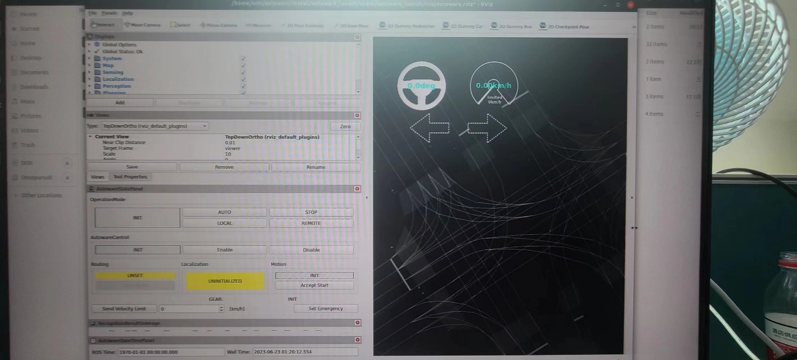
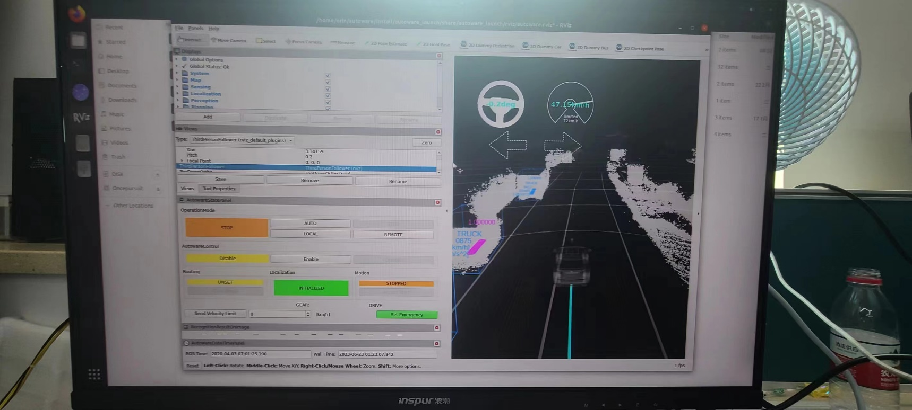
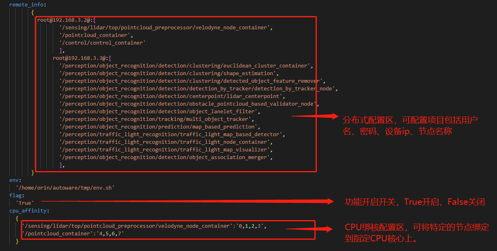
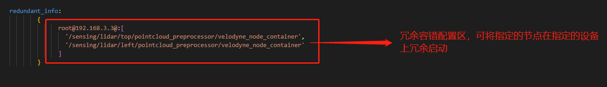

# Usage Instructions

## Introduction to Directory Structure
-  autodrrt.application directory corresponds to the functionality packages and management packages in the hierarchical diagram, encompassing the full chain of autonomous driving functions such as perception and planning.

- autodrrt.computing directory corresponds to the distributed computing, computation optimization, and fault tolerance functionality packages.

- autodrrt.tools directory corresponds to various tools.

- autodrrt.core directory includes the message definitions and dependency libraries required for the implementation of AutoDRRT.

- autodrrt.data directory includes the model data files for AutoDRRT.

- autodrrt.scene directory includes the packages needed for scene transitions. 

- autodrrt.driver directory corresponds to various sensor drive

## Demo Run Instructions

1.  Grant container access to display GUI: Open a terminal (Terminal A) and enter `xhost +` and press Enter.

2.  Enter the container: Run `docker exec --it autodrrt  /bin/bash` and press Enter.

3.  Navigate to the Autoware directory: Run `cd /home/orin/autodrrt/`.

4.  Open another terminal (Terminal B) and follow the previous two steps.

5.  In Terminal A, run `./start_demo.sh` and wait for the rviz2 interface to appear, displaying the map.
    

6.  In Terminal B, run `./play_rosbag.sh` to start the demo.
    

## Distributed Tools Usage Instructions

> The distributed tools allow you to easily transform a single-machine application into a multi-machine application. Follow these steps:

1.  Open the configuration file: The configuration file path is `{workspace}/autodrrt/install/autodrrt_launch/share/launch/param/node_config.param.yaml`.

2.  Configure the file content as follows:
    

    > In the configuration file, specify the nodes/containers that will start on the corresponding device nodes. Nodes not specified will start on the current device. The device username is fixed as `root`, and the IP address can be changed to the actual IP in use.

3.  Execute the launch operation as usual.

4.  Shutdown: Simply pressing Ctrl+C may not completely close processes on other devices. Run the `killtask.sh` script in the autoware directory to ensure all processes on the devices are completely closed.

## Fault Tolerance Tools Usage Instructions

1.  Open the configuration file, which is identical to the distributed functionality configuration file.

2.  Modify the `redundant_info` field in the configuration file.

3.  Execute the launch operation as usual.
    

    > Note: This feature requires the fault-tolerant communication feature, which is enabled by default. After enabling it, applications that rely on the ros2 package in Hermes (including x86 and Orin) can communicate with the existing framework. Applications that rely on other ros2 packages may be affected in terms of communication.

## Acceleration Toolkit Usage Instructions

### General Acceleration Tool

1.  Run environment optimization using `./GeneralAccelerator --opt-env=true`. This needs to be executed **outside the container**. It is already performed by default.

2.  You can also accelerate inference of models using `./GeneralAccelerator --model-path=/path_to_model`. This will generate an optimized TRT model in the model directory. This step requires **an NVIDIA GPU device and is executed within the container**.

## Detailed Examples of New Features

-  [Full pipeline for BEV model training and efficient inference.](bev_example.md)

-  [DDS_Opt: High-efficiency data communication based on DMA and DDS.](dds_dma.md)

-  [IO_Opt: GPU data sharing between nodes.](gpu_dds.md)

-  [A variety of autonomous driving development tools.](tools.md)

-  [Rich list of sensor drivers.](drivers.md)