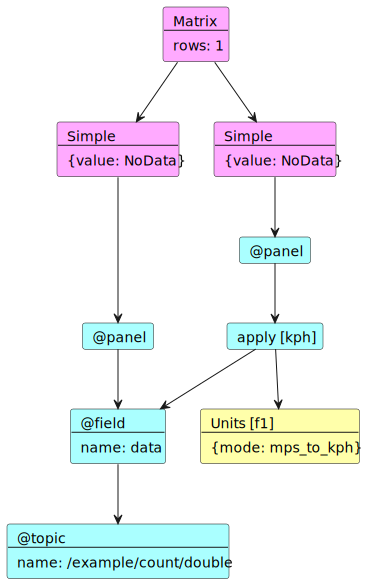

# コマンドラインツール

## Config parser

### Usage

コンフィグファイルの構造を確認するコマンドです。

```bash
ros2 run multi_data_monitor parser <scheme> <path> [other-options]
```

| 引数         | 説明                                                   |
| ------------ | ------------------------------------------------------ |
| `scheme`     | Rvizでの利用と同じく file か package を指定します。    |
| `path`       | 上記の scheme に対応したパスを指定します。             |
| `--plantuml` | コンフィグファイルの構造を plantuml 形式で出力します。 |

### Visualization

オプションで `--plantuml` を使用すると作業ディレクトリに `multi-data-monitor.plantuml` が生成されます。
ウィジェットは桃色、ストリームは水色、フィルターは黄色で表示されます。



## Config runner

### Usage

Rvizを使用せずにデータの流れのみを確認するコマンドです。現在作成中。

```bash
ros2 run multi_data_monitor runner <scheme> <path>
```

| 引数     | 説明                                                |
| -------- | --------------------------------------------------- |
| `scheme` | Rvizでの利用と同じく file か package を指定します。 |
| `path`   | 上記の scheme に対応したパスを指定します。          |
