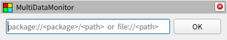
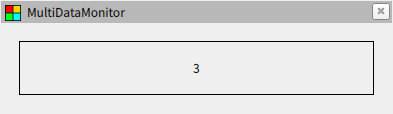

# 基本操作

## パネル作成時の初期設定

RViz のメニューからパネルを追加すると以下のようなウィジェットが追加されます。フォームにコンフィグファイルのパスを入力して OK ボタンを押すと設定が読み込まれて表示が切り替わります。エラーが発生した場合は詳細が表示されます。



設定ファイルのパスは以下のフォーマットで指定でき、パッケージフォーマットの場合は最初の階層を ROS パッケージのパスに置き換えます。ファイルフォーマットで絶対パスを指定する場合はスラッシュが三つ連続することに注意してください。

| Format                                 | Example                                         |
| -------------------------------------- | ----------------------------------------------- |
| package://&lt;package&gt;/&lt;path&gt; | package://multi_data_monitor/config/sample.yaml |
| file://&lt;path&gt;                    | file:///home/user-name/config/sample.yaml       |

## パネルでのキー操作

パネルでは以下のキー操作がサポートされています。

| Command            | Description                                                              |
| ------------------ | ------------------------------------------------------------------------ |
| Ctrl + left click  | 初期設定画面の表示状態を切り替えます。現在の画面は継続して表示されます。 |
| Shift + left click | タイトルバーの表示状態を切り替えます。                                   |

## コンフィグファイルの読み込み

まずは、最も単純な構成でデータを表示します。テスト用のトピックを流すために、新しく端末を開いて multi_data_monitor のワークスペースに移動し、以下のコマンドを実行します。

```bash
source install/setup.bash
ros2 run multi_data_monitor example
```

続いて、別の端末から RViz を起動し、パネルを追加して以下のパスを入力します。次に OK ボタンを押して表示が切り替わったら読み込み完了です。

```txt
package://multi_data_monitor/documents/tutorials/01/simple1.yaml
```

最初に起動したテスト用のノードは 0 から 4 までカウントするトピックを流しています。そして、先ほど開いた Rviz のパネルではこのデータを表示するように設定しているため、以下のようにトピックのデータが表示されます。



## コンフィグファイルの構成

先ほと使用したコンフィグファイルは以下のようになっています。まずはじめにバージョン情報を `version` で指定します。これはドットで区切られた２つの整数からなる文字列で、コンフィグファイルの互換性を確認するために使用されます。次にスタイルを `stylesheets` で設定していますが、これは別の章で説明するので詳細は省きます。簡単に触れておくと枠線やフォントサイズなどの設定が入っています。最も重要なのは `widgets` と `streams` の内容で、トピックの指定や表示に関する設定を行っています。

[package://multi_data_monitor/documents/tutorials/01/simple1.yaml](simple1.yaml)

```yaml
version: 2.0

stylesheets:
  - { path: package://multi_data_monitor/css/plugins/simple.css, target: Simple }

widgets:
  - { class: Simple, input: s1 }

streams:
  - { class: subscription, label: s1, topic: /example/count/uint32, field: data }
```

基本的な仕組みとして multi_data_monitor のコンフィグファイルではグラフ構造を定義します。ストリームはデータの流れを制御するオブジェクトで、その動作は `class` の種類によって決まります。ここで設定している `subscription` は ROS のトピックを受信するオブジェクトであり、指定したトピックの特定のフィールドのデータにアクセスできるようになります。また、後で他のオブジェクトから参照するために `label` として任意の名前を設定することができます。

ウィジェットは RViz での表示を制御するオブジェクトです。こちらも `class` の種類に応じて様々な形式でデータを表示できます。ここで設定している `Simple` は入力されたデータを文字列として解釈し、そのまま画面に表示するオブジェクトです。入力は `input` にストリームオブジェクトを指定します。サンプルではストリームオブジェクトの `label` で指定した `s1` という名前を設定しています。これにより、ストリームが受信したトピックのデータがウィジェットにまで届き、画面に表示されるようになります。

## コンフィグファイルの文法

サンプルのコンフィグファイルではウィジェットとストリームを別々に定義した上でラベルを使って接続していましたが、以下のようにストリームの定義をウィジェットの入力として直接記載することもできます。また、いくつかの頻出する用途については別記法が用意されている場合もあります。詳細については [Config file format](../../classes/index.md) を参照してください。

[package://multi_data_monitor/documents/tutorials/01/simple2.yaml](simple2.yaml)

```yaml
version: 2.0

stylesheets:
  - { path: package://multi_data_monitor/css/plugins/simple.css, target: Simple }

widgets:
  - class: Simple
    input: { class: subscription, label: s1, topic: /example/count/uint32, field: data }
```
