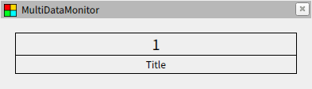
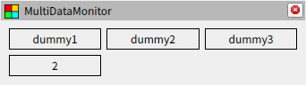
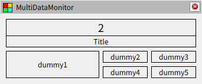

# ウィジェットについて

## ウィジェットの分類

ウィジェットには表示ウィジェットと配置ウィジェットの２種類があります。表示ウィジェットは前章の `Simple` のようにストリームからデータを受け取って画面に表示します。一方、配置ウィジェットはストリームではなく他のウィジェットを `items` として受け取って配置を行います。このとき、ウィジェットの接続関係は木構造になっている必要があり、パネルには木構造の根となるオブジェトが自動的に選択されます。

## 表示ウィジェット

表示ウィジェットの例として `Titled` を紹介します。再び RViz を開いて以下の設定ファイルを読み込んでください。動作確認用の example ノードも先程と同じように起動します。このウィジェットはデータの下にタイトルを表示するデザインになっています。

[package://multi_data_monitor/documents/tutorials/02/titled.yaml](titled.yaml)

## 配置ウィジェット

配置ウィジェットの例として `Matrix` を紹介します。再び RViz を開いて以下の設定ファイルを読み込んでください。動作確認用の example ノードも先程と同じように起動します。このウィジェットは他のウィジェットを行列状に並べることができます。

[package://multi_data_monitor/documents/tutorials/02/matrix1.yaml](matrix1.yaml)

また、`Matrix` 自身もウィジェットであるため、入れ子にして以下のような複雑なレイアウトを作成することも可能です。

[package://multi_data_monitor/documents/tutorials/02/matrix2.yaml](matrix2.yaml)

