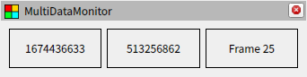

# ストリームについて

## ストリームのデータ

ストリームはデータの流れを制御していて YAML 形式のデータが流れています。また、スタイルを設定するために文字列型の key value 形式のデータも流れていますが、これはスタイルシートの章で詳しく解説します。ユーザーは基本的に、データの入力を行う `subscription` と、データの加工を行う `apply` の２つを使用し、その結果をウィジェットに渡すことになります。

他にもデバッグ用にデータの表示を行う `print` や、システムが内部的に用いる `@topic` や `@field` などの特殊なストリームがありますが、ユーザーがこれらを直接利用することはありません。これらのストリームについて知りたい場合は [Config file format](../../classes/index.md) を参照してください。

## データの入力

ROS のトピックからデータを取得するには `subscription` を使用します。対象のトピックを `topic` に、アクセスしたいフィールドを `field` に指定します。階層化されたフィールドにアクセスする場合は `foo.bar.baz` とドットで区切り、配列を参照する場合は `name@1` とアットサインに続けてインデックスを指定します。トピックの型や QoS が指定されていない場合、対象のトピックの設定を見て自動的に解決します。また、複数の `subscription` でトピックやフィールドが重複する場合は自動的にマージされるため、同じトピックのフィールドを異なる箇所で指定しても問題ありません。

以下が `subscription` を使用した設定ファイルの例です。また `subscription` には別記法が用意されており、設定ファイルの直下に専用のセクションを記載することができます。

[package://multi_data_monitor/documents/tutorials/03/subscription1.yaml](subscription1.yaml)
[package://multi_data_monitor/documents/tutorials/03/subscription2.yaml](subscription2.yaml)

## データの加工

データを加工するには `apply` を使用します。これは入力されたデータにフィルターを適用するストリームです。フィルターについては次の章を参照してください。

## データの確認

デバッグ用のストリームは現在開発中です。
