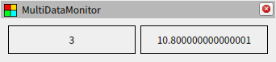
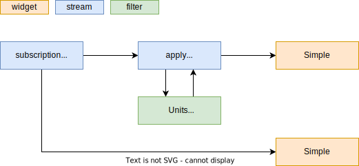
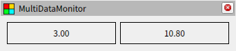

# フィルターについて

## フィルターの適用

例えば単位が m/s のデータを km/h で表示したいことがあります。以下の設定ファイルではトピックのデータが左側にはそのまま m/s で表示され、右側には km/h に変換した結果が表示されます。

[package://multi_data_monitor/documents/tutorials/04/filter1.yaml](filter1.yaml)

これを実現しているのがフィルターです。フィルターは関数のようなもので、設定ファイルの `filters` セクションに処理の内容を記載します。これをストリームの `apply` クラスの `rules` に指定することで、そのストリームに入力されたデータにフィルターの処理が適用されます。

## フィルターの組み合わせ

ストリームの `apply` クラスには複数のフィルターを指定できます。複数のフィルターを配列として `rules` に設定するとそれらが順番に適用されます。以下の設定ファイルでは、単位の変換に加えて小数点の桁数指定を行っています。

[package://multi_data_monitor/documents/tutorials/04/filter2.yaml](filter2.yaml)

また、複数のフィルターをまとめて一つのフィルターを定義することもできます。この場合は `function` という組み込みのフィルターを利用します。このフィルターは `apply` ストリームと同様に `rules` を設定できるので、ここに適用したいフィルターを列挙します。

[package://multi_data_monitor/documents/tutorials/04/filter3.yaml](filter3.yaml)

