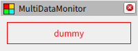
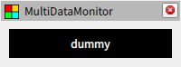
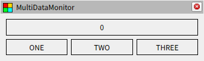
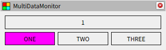
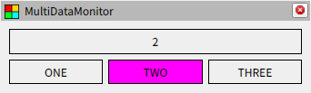
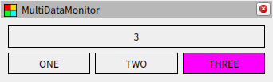
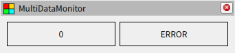
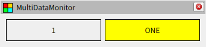
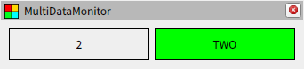
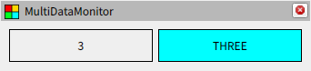

# スタイルシート

## スタイルの指定

スタイルの指定には Qt Style Sheets がそのまま使われています。コンフィグファイルの `stylesheets` は配列になっており、各要素で以下のようにスタイルシートのパスを指定します。特定のウィジェットにのみスタイルを反映したい場合は `target` にウィジェットの名前を記載してください。省略した場合は全てのウィジェットに適用されます。複数の要素で同じウィジェットを指定した場合、ファイルの内容を結合して適用します。

これまでのチュートリアルで使っていた [simple.css](../../../css/plugins/simple.css) はデフォルトで用意されている `Simple` ウィジェット用のスタイルシートで、枠線とフォントサイズの設定が記載されています。また、以下の例で使用する [colors.css](../../../css/colors.css) は文字色と背景色に関する設定が記載されています。

## スタイルの例

以下がスタイルシートの設定例です。スタイルシートの文法については Qt のドキュメントを参照してください。また、対象とするウィジェットの構成に合わせてクラスセレクタを使用する場合、各ウィジェットの詳細を参照して使用されている Qt のクラス情報を確認してください。

[package://multi_data_monitor/documents/tutorials/05/style1.yaml](style1.yaml) / [style1.css](style1.css)



[package://multi_data_monitor/documents/tutorials/05/style2.yaml](style2.yaml) / [style2.css](style2.css)



## 属性セレクター

スタイルシートの記述で以下のように属性セレクターを指定すると、データが特定の条件を満たした時のみスタイルを適用することができます。以前に触れたように、ストリームを流れるデータには YAML 形式の `value` と、文字列型の key value 形式の `attrs` があり、スタイルの設定には `attrs` が使用されます。実装としては `QObject::setProperty` にこのデータを設定しているので、詳しい仕組みについては Qt のドキュメントを参照してください。

```txt
QLabel [key="value"]
{
  color: red;
}
```

フィルターの中には `attrs` を変更するものがあります。例えば `SetIf` や `SetFirstIf` では条件に一致した時に `value` と `attrs` が設定されます。これにより、データが指定した条件を満たした時に文字列や色を変化させることができます。以下が設定例です。

[package://multi_data_monitor/documents/tutorials/05/style3.yaml](style3.yaml)






[package://multi_data_monitor/documents/tutorials/05/style4.yaml](style4.yaml)





