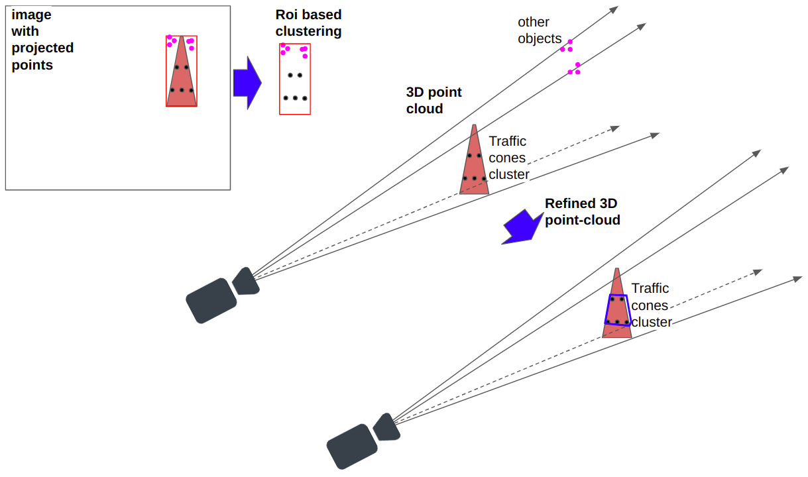

# roi_pointcloud_fusion

## Purpose

The node `roi_pointcloud_fusion` is to cluster the pointcloud based on Region Of Interests (ROIs) detected by a 2D object detector, specific for unknown labeled ROI.

## Inner-workings / Algorithms

- The pointclouds are projected onto image planes and extracted as cluster if they are inside the unknown labeled ROIs.
- Since the cluster might contain unrelated points from background, then a refinement step is added to filter the background pointcloud by distance to camera.

## Inputs / Outputs

### Input

| Name                     | Type                                                     | Description                                               |
| ------------------------ | -------------------------------------------------------- | --------------------------------------------------------- |
| `input`                  | `sensor_msgs::msg::PointCloud2`                          | input pointcloud                                          |
| `input/camera_info[0-7]` | `sensor_msgs::msg::CameraInfo`                           | camera information to project 3d points onto image planes |
| `input/rois[0-7]`        | `tier4_perception_msgs::msg::DetectedObjectsWithFeature` | ROIs from each image                                      |
| `input/image_raw[0-7]`   | `sensor_msgs::msg::Image`                                | images for visualization                                  |

### Output

| Name              | Type                                                     | Description                                  |
| ----------------- | -------------------------------------------------------- | -------------------------------------------- |
| `output`          | `sensor_msgs::msg::PointCloud2`                          | output pointcloud as default of interface    |
| `output_clusters` | `tier4_perception_msgs::msg::DetectedObjectsWithFeature` | output clusters                              |
| `debug/clusters`  | `sensor_msgs/msg/PointCloud2`                            | colored cluster pointcloud for visualization |

## Parameters

### Core Parameters

| Name                   | Type   | Description                                                                                  |
| ---------------------- | ------ | -------------------------------------------------------------------------------------------- |
| `min_cluster_size`     | int    | the minimum number of points that a cluster needs to contain in order to be considered valid |
| `cluster_2d_tolerance` | double | cluster tolerance measured in radial direction                                               |
| `rois_number`          | int    | the number of input rois                                                                     |

## Assumptions / Known limits

- Currently, the refinement is only based on distance to camera, the roi based clustering is supposed to work well with small object ROIs. Others criteria for refinement might needed in the future.

<!-- Write assumptions and limitations of your implementation.

Example:
  This algorithm assumes obstacles are not moving, so if they rapidly move after the vehicle started to avoid them, it might collide with them.
  Also, this algorithm doesn't care about blind spots. In general, since too close obstacles aren't visible due to the sensing performance limit, please take enough margin to obstacles.
-->

## (Optional) Error detection and handling

<!-- Write how to detect errors and how to recover from them.

Example:
  This package can handle up to 20 obstacles. If more obstacles found, this node will give up and raise diagnostic errors.
-->

## (Optional) Performance characterization

<!-- Write performance information like complexity. If it wouldn't be the bottleneck, not necessary.

Example:

  ### Complexity

  This algorithm is O(N).

  ### Processing time

  ...
-->

## (Optional) References/External links

<!-- Write links you referred to when you implemented.

Example:
  [1] {link_to_a_thesis}
  [2] {link_to_an_issue}
-->

## (Optional) Future extensions / Unimplemented parts

<!-- Write future extensions of this package.

Example:
  Currently, this package can't handle the chattering obstacles well. We plan to add some probabilistic filters in the perception layer to improve it.
  Also, there are some parameters that should be global(e.g. vehicle size, max steering, etc.). These will be refactored and defined as global parameters so that we can share the same parameters between different nodes.
-->
