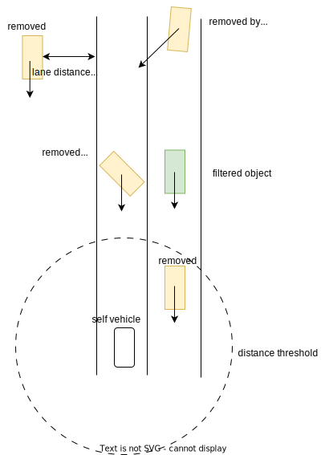

# models

Tracking models can be chosen from the ros parameter `~tracking_model`:

Each model has its own parameters, which can be set in the ros parameter server.

- model name
  - parameter name for general
  - override parameter name for each tracking object class

## linear constant acceleration model

- prediction

$$
\begin{bmatrix}
x_{k+1} \\
y_{k+1} \\
v_{x_{k+1}} \\
v_{y_{k+1}} \\
a_{x_{k+1}} \\
a_{y_{k+1}}
\end{bmatrix} =
\begin{bmatrix}
1 & 0 & dt & 0 & \frac{1}{2}dt^2 & 0 \\
0 & 1 & 0 & dt & 0 & \frac{1}{2}dt^2 \\
0 & 0 & 1 & 0 & dt & 0 \\
0 & 0 & 0 & 1 & 0 & dt \\
0 & 0 & 0 & 0 & 1 & 0 \\
0 & 0 & 0 & 0 & 0 & 1 \\
\end{bmatrix}
\begin{bmatrix}
x_k \\
y_k \\
v_{x_k} \\
v_{y_k} \\
a_{x_k} \\
a_{y_k}
\end{bmatrix} + noise
$$

- noise model

  - random walk in acc: 2 parameters(currently disabled)
  - random state noise: 6 parameters
    $$
    \begin{align}
    noise &= \begin{bmatrix}
    \frac{dt^{3}}{6} \\ 0\\ \frac{dt^{2}}{2} \\ 0 \\ dt \\0
    \end{bmatrix} \nu_{ax_k} + \begin{bmatrix}
    0 \\ \frac{dt^{3}}{6} \\ 0 \\ \frac{dt^{2}}{2} \\ 0 \\ dt
    \end{bmatrix} \nu_{ay_k}  &  \text{(random walk in acc)} \\
    noise &= \begin{bmatrix}
    \nu_{x_k} \\ \nu_{y_k} \\ \nu_{v_{x_k}} \\ \nu_{v_{y_k}} \\ \nu_{a_{x_k}} \\ \nu_{a_{y_k}}
    \end{bmatrix} &
     \text{(random state noise)} &
    \end{align}
    $$

- observation
  - observation: x,y,vx,vy
  - observation noise: 4 parameters

## constant turn rate and velocity model

Just idea, not implemented yet.

$$
\begin{align}
x_{k+1} &= x_k + \frac{v_k}{\omega_k} (sin(\theta_k + \omega_k dt) - sin(\theta_k)) \\
y_{k+1} &= y_k + \frac{v_k}{\omega_k} (cos(\theta_k) - cos(\theta_k + \omega_k dt)) \\
v_{k+1} &= v_k \\
\theta_{k+1} &= \theta_k + \omega_k dt \\
\omega_{k+1} &= \omega_k
\end{align}
$$

## Noise filtering

Radar sensors often have noisy measurement. So we use the following filter to reduce the false positive objects.

The figure below shows the current noise filtering process.

### minimum range filter

In most cases, Radar sensors are used with other sensors such as LiDAR and Camera, and Radar sensors are used to detect objects far away. So we can filter out objects that are too close to the sensor.

`use_distance_based_noise_filtering` parameter is used to enable/disable this filter, and `minimum_range_threshold` parameter is used to set the threshold.

### lanelet based filter

With lanelet map information, We can filter out false positive objects that are not likely important obstacles.

We filter out objects that satisfy the following conditions:

- too large lateral distance from lane
- velocity direction is too different from lane direction
- too large lateral velocity

Each condition can be set by the following parameters:

- `max_distance_from_lane`
- `max_angle_diff_from_lane`
- `max_lateral_velocity`
