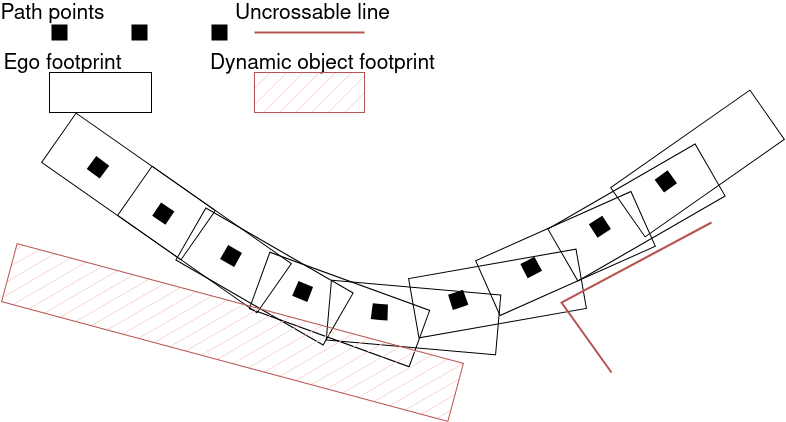
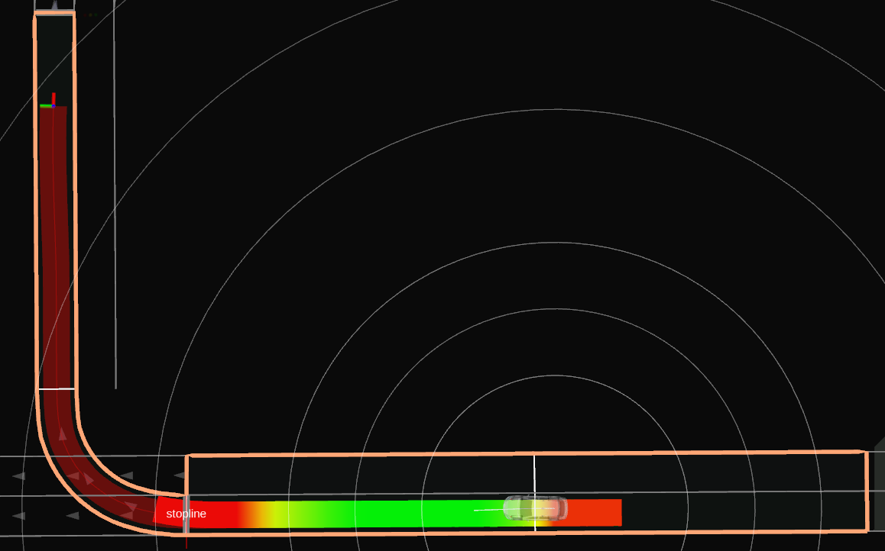

# Drivable Area design

Drivable Area represents the area where ego vehicle can pass.

## Purpose / Role

In order to defined the area that ego vehicle can travel safely, we generate drivable area in behavior path planner module. Our drivable area is represented by two line strings, which are `left_bound` line and `right_bound` line respectively. Both `left_bound` and `right_bound` are created from left and right boundaries of lanelets. Note that `left_bound` and `right bound` are generated by `generateDrivableArea` function.

## Assumption

Our drivable area has several assumptions.

- Drivable Area should have all of the necessary area but should not represent unnecessary area for current behaviors. For example, when ego vehicle is in `follow lane` mode, drivable area should not contain adjacent lanes.

- When generating a drivable area, lanes need to be arranged in the order in which cars pass by (More details can be found in following sections).

- Both left and right bounds should cover the front of the path and the end of the path.

## Limitations

Currently, when clipping left bound or right bound, it can clip the bound more than necessary and the generated path might be conservative.

## Parameters for drivable area generation

| Name                                         | Unit | Type         | Description                                                                                                                                                                              | Default value             |
| :------------------------------------------- | :--- | :----------- | :--------------------------------------------------------------------------------------------------------------------------------------------------------------------------------------- | :------------------------ |
| enabled                                      | [-]  | boolean      | whether to dynamically the drivable area using the ego footprint                                                                                                                         | false                     |
| ego.extra_footprint_offset.front             | [m]  | double       | extra length to add to the front of the ego footprint                                                                                                                                    | 0.0                       |
| ego.extra_footprint_offset.rear              | [m]  | double       | extra length to add to the rear of the ego footprint                                                                                                                                     | 0.0                       |
| ego.extra_footprint_offset.left              | [m]  | double       | extra length to add to the left of the ego footprint                                                                                                                                     | 0.0                       |
| ego.extra_footprint_offset.right             | [m]  | double       | extra length to add to the rear of the ego footprint                                                                                                                                     | 0.0                       |
| dynamic_objects.avoid                        | [-]  | boolean      | if true, the drivable area is not expanded in the predicted path of dynamic objects                                                                                                      | true                      |
| dynamic_objects.extra_footprint_offset.front | [m]  | double       | extra length to add to the front of the ego footprint                                                                                                                                    | 0.5                       |
| dynamic_objects.extra_footprint_offset.rear  | [m]  | double       | extra length to add to the rear of the ego footprint                                                                                                                                     | 0.5                       |
| dynamic_objects.extra_footprint_offset.left  | [m]  | double       | extra length to add to the left of the ego footprint                                                                                                                                     | 0.5                       |
| dynamic_objects.extra_footprint_offset.right | [m]  | double       | extra length to add to the rear of the ego footprint                                                                                                                                     | 0.5                       |
| max_distance                                 | [m]  | double       | maximum distance by which the drivable area can be expended. A value of 0.0 means no maximum distance.                                                                                   | 0.0                       |
| expansion.method                             | [-]  | string       | method to use for the expansion: "polygon" will expand the drivable area around the ego footprint polygons; "lanelet" will expand to the whole lanelets overlapped by the ego footprints | "polygon"                 |
| expansion.max_arc_path_length                | [m]  | double       | maximum length along the path where the ego footprint is projected                                                                                                                       | 50.0                      |
| expansion.extra_arc_length                   | [m]  | double       | extra arc length (relative to the path) around ego footprints where the drivable area is expanded                                                                                        | 0.5                       |
| expansion.avoid_linestring.types             | [-]  | string array | linestring types in the lanelet maps that will not be crossed when expanding the drivable area                                                                                           | [guard_rail, road_border] |
| avoid_linestring.distance                    | [m]  | double       | distance to keep between the drivable area and the linestrings to avoid                                                                                                                  | 0.0                       |
| avoid_linestring.compensate.enable           | [-]  | bool         | if true, when the expansion is blocked by a linestring on one side of the path, we try to compensate and expand on the other side                                                        | true                      |
| avoid_linestring.compensate.extra_distance   | [m]  | double       | extra distance added to the expansion when compensating                                                                                                                                  | 3.0                       |

The following parameters are defined for each module. Please refer to the `config/drivable_area_expansion.yaml` file.

| Name                             | Unit | Type   | Description                                                                | Default value |
| :------------------------------- | :--- | :----- | :------------------------------------------------------------------------- | :------------ |
| drivable_area_right_bound_offset | [m]  | double | right offset length to expand drivable area                                | 5.0           |
| drivable_area_left_bound_offset  | [m]  | double | left offset length to expand drivable area                                 | 5.0           |
| drivable_area_types_to_skip      | [-]  | string | linestring types (as defined in the lanelet map) that will not be expanded | road_border   |

## Inner-workings / Algorithms

This section gives details of the generation of the drivable area (`left_bound` and `right_bound`).

### Drivable Lanes Generation

Before generating drivable areas, drivable lanes need to be sorted. Drivable Lanes are selected in each module (`Lane Follow`, `Avoidance`, `Lane Change`, `Goal Planner`, `Pull Out` and etc.), so more details about selection of drivable lanes can be found in each module's document. We use the following structure to define the drivable lanes.

```cpp
struct DrivalbleLanes
{
    lanelet::ConstLanelet right_lanelet; // right most lane
    lanelet::ConstLanelet left_lanelet; // left most lane
    lanelet::ConstLanelets middle_lanelets; // middle lanes
};
```

The image of the sorted drivable lanes is depicted in the following picture.


Note that, the order of drivable lanes become

```cpp
drivable_lanes = {DrivableLane1, DrivableLanes2, DrivableLanes3, DrivableLanes4, DrivableLanes5}
```

### Drivable Area Generation

In this section, a drivable area is created using drivable lanes arranged in the order in which vehicles pass by. We created `left_bound` from left boundary of the leftmost lanelet and `right_bound` from right boundary of the rightmost lanelet. The image of the created drivable area will be the following blue lines. Note that the drivable area is defined in the `Path` and `PathWithLaneId` messages as

```cpp
std::vector<geometry_msgs::msg::Point> left_bound;
std::vector<geometry_msgs::msg::Point> right_bound;
```

and each point of right bound and left bound has a position in the absolute coordinate system.


### Drivable Area Expansion

#### Static Expansion

Each module can statically expand the left and right bounds of the target lanes by the parameter defined values.
This enables large vehicles to pass narrow curve. The image of this process can be described as


Note that we only expand right bound of the rightmost lane and left bound of the leftmost lane.

#### Dynamic Expansion

The drivable area can also be expanded dynamically by considering the ego vehicle footprint projected on each path point.
This expansion can be summarized with the following steps:

1. Build the ego path footprint.
2. Build the dynamic objects' predicted footprints (optional).
3. Build "uncrossable" lines.
4. Remove the footprints from step 2 and the lines from step 3 from the ego path footprint from step 1.
5. Expand the drivable area with the result of step 4.

|                                  |                                                                                                      |
| :------------------------------- | :--------------------------------------------------------------------------------------------------- |
| Inputs                           |          |
| Footprints and uncrossable lines |  |
| Expanded drivable area           |          |

Please note that the dynamic expansion can only increase the size of the drivable area and cannot remove any part from the original drivable area.

### Visualizing maximum drivable area (Debug)

Sometimes, the developers might get a different result between two maps that may look identical during visual inspection.

For example, in the same area, one can perform avoidance and another cannot. This might be related to the maximum drivable area issues due to the non-compliance vector map design from the user.

To debug the issue, the maximum drivable area boundary can be visualized.




The maximum drivable area can be visualize by adding the marker from `/planning/scenario_planning/lane_driving/behavior_planning/behavior_path_planner/maximum_drivable_area`

#### Expansion with hatched road markings area

If the hatched road markings area is defined in the lanelet map, the area can be used as a drivable area.
Since the area is expressed as a polygon format of Lanelet2, several steps are required for correct expansion.


