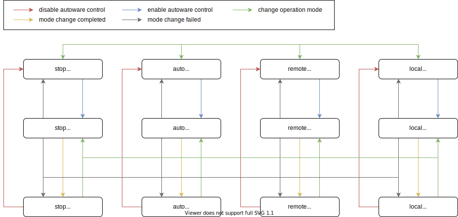

# Operation mode API

## Overview

Introduce operation mode. It handles autoware engage, gate_mode, external_cmd_selector and control_mode abstractly. When the mode is changed, it will be in-transition state, and if the transition completion condition to that mode is not satisfied, it will be returned to the previous mode. Also, currently, the condition for mode change is only `WaitingForEngage` in `/autoware/state`, and the engage state is shared between modes. After introducing the operation mode, each mode will have a transition available flag. See the [autoware-documentation](https://autowarefoundation.github.io/autoware-documentation/v1.0/design/autoware-interfaces/ad-api/features/operation_mode/) for AD API specifications.

## States

The operation mode has the following state transitions. Disabling autoware control and changing operation mode when autoware control is disabled can be done immediately.
Otherwise, enabling autoware control and changing operation mode when autoware control is enabled causes the state will be transition state.
If the mode change completion condition is not satisfied within the timeout in the transition state, it will return to the previous mode.

## Compatibility

Ideally, vehicle_cmd_gate and external_cmd_selector should be merged so that the operation mode can be handled directly.
However, currently the operation mode transition manager performs the following conversions to match the implementation.
The transition manager monitors each topic in the previous interface and synchronizes the operation mode when it changes.
When the operation mode is changed with the new interface, the transition manager disables synchronization and changes the operation mode using the previous interface.

