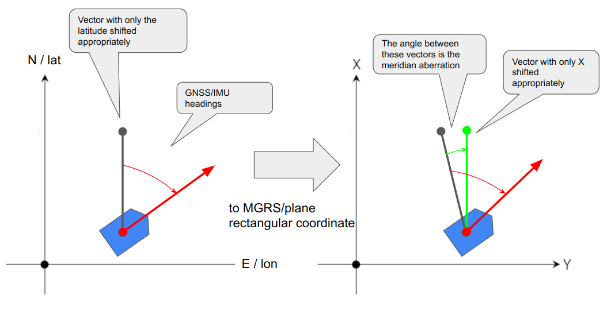

# llh_converter

(Updated 2023/02/09)

This repository has two class implementation.

* HeightConverter
* LLHConverter

There is also a function for the Meridian convergence angle correction.

---

## HeightConverter

Convert height between ellipsoid and orthometric library

### Supported Geoid Models

* EGM2008-1
* GSIGEO2011 Ver2.1

### Usage

```
llh_converter::HeightConverter hc;

hc.setGeoidType(height_converter::GeoidType::GSIGEO2011); // Select Geoid Model
// hc.setGeoidType(height_converter::GeoidType::EGM2008);

hc.setGSIGEOGeoidFile(path_to_gsigeo_asc_file);   // Load geoid data file when you select GSIGEO
// hc.setGSIGEOGeoidFile();  // If called with void, it try to read /usr/share/GSIGEO/gsigeo2011_ver2_1.asc

double geoid_heith = hc.getGeoid(lat, lon);   // Get geoid heigth with latitude/longitude in decimal degree

// Convert height between ellipsoid and orthometric
double converted_height = hc.convertHeight(lat, lon, h, height_converter::ConvertType::ORTHO2ELLIPS);
double converted_height = hc.convertHeight(lat, lon, h, height_converter::ConvertType::ELLIPS2ORTHO);
```

---

## LLHConverter

Convert latitude/longitude/altitude into XYZ coordinate system.

### Supported coordinate systems

* Millitary Grid Reference System (MGRS)
* Japan Plane Rectangular Coordinate System (JPRCS)

### Usage

```
llh_converter::LLHConverter lc;
llh_converter::LLHParam param;  // parameter for conversion
param.use_mgrs = true;          // set true if you want to use MGRS
param.plane_num = 9;            // set the plane number when you use JPRCS
param.mgrs_code = "53SPU";      // MGRS grid code is required when you revert MGRS x/y into lat/lon
param.height_convert_type = llh_converter::ConvertType::ELLIPS2ORTHO;
                                // You can also convert height
param.geoid_type = llh_converter::GeoidType::EGM2008;
                                // Set geoid model

double lat_deg, lon_deg, alt;
double lat_rad = lat_deg * M_PI / 180.;
double lon_rad = lon_deg * M_PI / 180.;
double x, y, z;

lc.convertDeg2XYZ(lat_deg, lon_deg, alt, x, y, z, param);
lc.convertRad2XYZ(lat_rad, lon_rad, alt, x, y, z, param);

lc.revertXYZ2Deg(x, y, lat_deg, lon_deg, param);
lc.revertXYZ2Rad(x, y, lat_rad, lon_rad, param);
```

---

## meridian convergence angle correction

The meridian convergence angle is the angle of difference between true north and coordinate north.

The meridian convergence angle is calculated by the `getMeridianConvergence()` function.



### Usage

```
  llh_converter::LLHConverter lc;
  llh_converter::LLHParam param;
  param.use_mgrs = false;
  param.plane_num = 7;
  param.height_convert_type = llh_converter::ConvertType::NONE;
  param.geoid_type = llh_converter::GeoidType::EGM2008;

  llh_converter::LLA lla;
  llh_converter::XYZ xyz;
  lla.latitude = test_lat;
  lla.longitude = test_lon;
  lla.altitude = 30.0;
  llh_converter.convertDeg2XYZ(lla.latitude, lla.longitude, lla.altitude, xyz.x, xyz.y, xyz.z, param);
  double mca = llh_converter::getMeridianConvergence(lla, xyz, llh_converter, param); // meridian convergence angle
```

---

## Install

```
sudo apt update
sudo apt install libgeographic-dev geographiclib-tools geographiclib-doc

sudo geographiclib-get-geoids best

mkdir -p test_ws/src
cd test_ws/src/
git clone https://github.com/MapIV/height_converter.git
sudo mkdir /usr/share/GSIGEO
sudo cp llh_converter/data/gsigeo2011_ver2_1.asc /usr/share/GSIGEO/
cd ../../
catkin_make -DCMAKE_BUILD_TYPE=Release
```

## Geoid model data

This package contains GSIGEO2011 geoid data file which is provided by Geospatial Information Authority of Japan.

[Official Website of Geospatial Information Authority of Japan](https://fgd.gsi.go.jp/download/geoid.php)

## LICENSE

This package is provided under the [BSD 3-Clauses](LICENSE) License.
