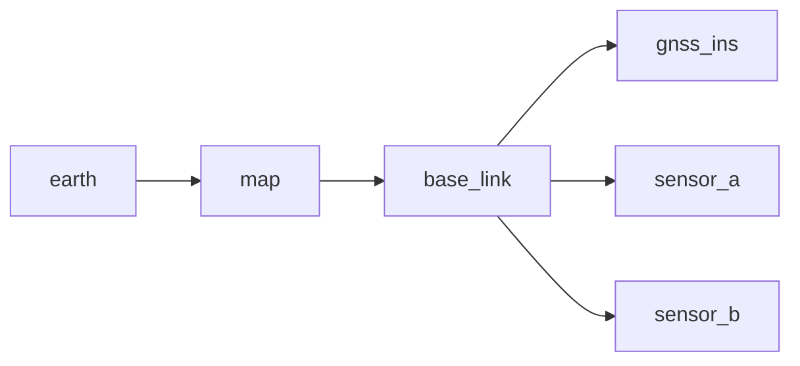
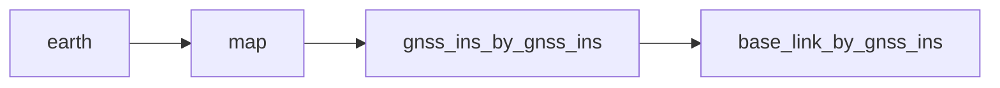

# autoware_sensing_msgs

## GNSS/INS sensor messages

**Possible Data Types:**

- Position
- Orientation
- Twist (Velocity)
  - linear
  - angular
- Accel
  - linear
  - angular

### Position

For this information, you can use the [NavSatFix](https://docs.ros.org/en/noetic/api/sensor_msgs/html/msg/NavSatFix.html) message.

If the sensor provides MSL(Mean Sea Level) for altitude, you can use it for the altitude field.

- `sensor_msgs/NavSatFix` following fields are used:
  - `std_msgs/Header` header
  - `float64` latitude
  - `float64` longitude
  - `float64` altitude
  - `float64[9]` position_covariance

For detailed info about the east, north, up, see the [Coordinate Axes Conventions](#coordinate-axes-conventions).

### Orientation

#### GnssInsOrientationStamped.msg

This message contains the GNSS-INS orientation information.

The orientation is represented by a quaternion.

If the sensor provides roll, pitch, yaw; you should convert it to quaternion.

- [Example with tf2](http://wiki.ros.org/tf2/Tutorials/Quaternions#CA-f7f08c472826d99550c915a0b177064bf5594654_1).

For detailed info about the roll, pitch, yaw and rotation axes see the [Coordinate Axes Conventions](#coordinate-axes-conventions).

### Velocity

For this information, you can use the [TwistWithCovarianceStamped](http://docs.ros.org/en/noetic/api/geometry_msgs/html/msg/TwistWithCovarianceStamped.html) message.

Its structure is as follows:

- `geometry_msgs/TwistWithCovarianceStamped` following fields are used:

  - `std_msgs/Header` header
  - `geometry_msgs/TwistWithCovariance` twist
    - `geometry_msgs/Twist` twist
      - `geometry_msgs/Vector3` linear
      - `geometry_msgs/Vector3` angular
    - `float64[36]` covariance

- The linear field contains the linear velocities in the x, y, z axes.
- The angular field contains the angular velocities in the x, y, z axes.
- The covariance matrix parameters are linear and angular velocities in order.

For detailed info about the covariance matrix [RMSE? Variances? Covariance Matrix?](#rmse-variances-covariance-matrix).

### Acceleration

For this information, you can use the [AccelWithCovarianceStamped](https://docs.ros.org/en/api/geometry_msgs/html/msg/AccelWithCovarianceStamped.html) message.

Its structure is as follows:

- `geometry_msgs/AccelWithCovarianceStamped` following fields are used:

  - `std_msgs/Header` header
  - `geometry_msgs/AccelWithCovariance` accel
    - `geometry_msgs/Accel` accel
      - `geometry_msgs/Vector3` linear
      - `geometry_msgs/Vector3` angular
    - `float64[36]` covariance

- The linear field contains the linear accelerations in the x, y, z axes.
- The angular field contains the angular accelerations in the x, y, z axes.
- The covariance matrix parameters are linear and angular accelerations in order.

For detailed info about the covariance matrix [RMSE? Variances? Covariance Matrix?](#rmse-variances-covariance-matrix).

## Design

### Coordinate Frames

Frames used in Autoware are defined as follows:



In Autoware, the `earth` frame is mostly omitted, only used in the `GnssInsPositionStamped` message.

The `map` frame is used as the stationary reference frame.

The `map` frame's axes point to the East, North, Up directions as explained in [Coordinate Axes Conventions](#coordinate-axes-conventions).

The `base_link` is the center of the rear axle of the vehicle.

`Map[map] --> base_link` is the main transformation that is attempted to be estimated by various localization modules. This transformation is output by the EKF(Extended Kalman Filter) localization module.

Other sensors' frames are defined with respect to the `base_link` frame in the vehicle.

### Estimating the `base_link` frame by using the other sensors

Generally we don't have the localization sensors physically at the `base_link` frame. So various sensors localize with respect to their own frames, let's call it `sensor` frame.

We introduce a new frame naming convention: `x_by_y`:

```yaml
x: estimated frame name
y: localization method/source
```

We cannot directly get the `sensor` frame. Because we would need the EKF module to estimate the `base_link` frame first.

Without the EKF module the best we can do is to estimate `Map[map] --> sensor_by_sensor --> base_link_by_sensor` using this sensor.

#### Example by the GNSS/INS sensor

For the integrated GNSS/INS we use the following frames:



The `gnss_ins_by_gnss_ins` frame is obtained by the coordinates from GNSS/INS sensor. The coordinates are converted to `map` frame using the `gnss_poser` node.

Finally `gnss_ins_by_gnss_ins` frame represents the position of the `gnss_ins` estimated by the `gnss_ins` sensor in the `map`.

Then by using the static transformation between `gnss_ins` and the `base_link` frame, we can obtain the `base_link_by_gnss_ins` frame. Which represents the `base_link` estimated by the `gnss_ins` sensor.

References:

- <https://www.ros.org/reps/rep-0105.html#earth>

### Coordinate Axes Conventions

We are using East, North, Up (ENU) coordinate axes convention by default throughout the stack.

```yaml
X+: East
Y+: North
Z+: Up
```

The position, orientation, velocity, acceleration are all defined in the same axis convention.

Position by the GNSS/INS sensor is expected to be in `earth` frame.

Orientation, velocity, acceleration by the GNSS/INS sensor are expected to be in the sensor frame. Axes parallel to the `map` frame.

If roll, pitch, yaw is provided, they correspond to rotation around X, Y, Z axes respectively.

```yaml
Rotation around:
  X+: roll
  Y+: pitch
  Z+: yaw
```

References:

- <https://www.ros.org/reps/rep-0103.html#axis-orientation>

### RMSE? Variances? Covariance Matrix?

#### Definitions

**RMSE:** Root Mean Square Error is a measure of the differences between values predicted by a model or an estimator and the values observed.

**Variance:** Squared deviation of a random variable from its sample mean.

**Covariance:** A measure of the joint variability of two random variables.

**Covariance Matrix:** A square matrix giving the covariance between each pair of elements of a given random vector

#### Simplified usage in Autoware

`RMSE² = Variance`

A covariance matrix is of `n` random variables is an `n×n` matrix.

Covariance with itself is the variance of the random variable.

The diagonal elements of the covariance matrix are the variances of the random variables.

In Autoware, only these variance values are used, mostly in the RMSE form. The rest of the covariance matrix is not used, can be left `0.0`.

#### Example for TwistWithCovariance

[This message](https://docs.ros.org/en/api/geometry_msgs/html/msg/TwistWithCovariance.html) contains the linear and angular velocities and the covariance matrix.

Let's call RMSE values for these calculations as `σ_x, σ_y, σ_z, σ_r, σ_p, σ_y`.

The covariance matrix can be constructed as follows:

| <span> | <span> | <span> | <span> | <span> | <span> |
| ------ | ------ | ------ | ------ | ------ | ------ |
| σ_x    | 0      | 0      | 0      | 0      | 0      |
| 0      | σ_y    | 0      | 0      | 0      | 0      |
| 0      | 0      | σ_z    | 0      | 0      | 0      |
| 0      | 0      | 0      | σ_r    | 0      | 0      |
| 0      | 0      | 0      | 0      | σ_p    | 0      |
| 0      | 0      | 0      | 0      | 0      | σ_y    |

In the message file, it is a `float64[36]` array. We fill the indices at `i*7, i:[0,6]`, making up `0,7,14,21,28,35`th indices of this array.

**References:**

- <https://en.wikipedia.org/wiki/Root-mean-square_deviation>
- <https://en.wikipedia.org/wiki/Variance#Biased_sample_variance>
- <https://en.wikipedia.org/wiki/Covariance#Covariance_with_itself>
- <https://en.wikipedia.org/wiki/Covariance_matrix>

### Q/A

- Why is position and orientation not combined as a PoseWithCovarianceStamped message?
  - Modern GNSS/INS sensors provide both of these together but more affordable gnss only sensors might provide only position information.
  - We separated them to allow if the INS sensor is separate, the orientation information can be extracted from there with aid of a magnetometer.
