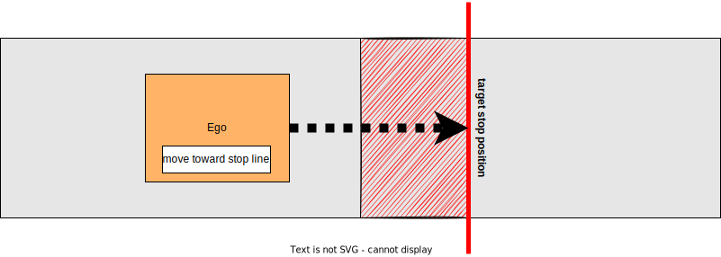

## Detection Area

### Role

If pointcloud is detected in a detection area defined on a map, the stop planning will be executed at the predetermined point.

### Activation Timing

This module is activated when there is a detection area on the target lane.

### Module Parameters

| Parameter                   | Type   | Description                                                                                        |
| --------------------------- | ------ | -------------------------------------------------------------------------------------------------- |
| `use_dead_line`             | bool   | [-] weather to use dead line or not                                                                |
| `use_pass_judge_line`       | bool   | [-] weather to use pass judge line or not                                                          |
| `state_clear_time`          | double | [s] when the vehicle is stopping for certain time without incoming obstacle, move to STOPPED state |
| `stop_margin`               | double | [m] a margin that the vehicle tries to stop before stop_line                                       |
| `dead_line_margin`          | double | [m] ignore threshold that vehicle behind is collide with ego vehicle or not                        |
| `hold_stop_margin_distance` | double | [m] parameter for restart prevention (See Algorithm section)                                       |

### Inner-workings / Algorithm

1. Gets a detection area and stop line from map information and confirms if there is pointcloud in the detection area
2. Inserts stop point l[m] in front of the stop line
3. Inserts a pass judge point to a point where the vehicle can stop with a max deceleration
4. Sets velocity as zero behind the stop line when the ego-vehicle is in front of the pass judge point
5. If the ego vehicle has passed the pass judge point already, it doesn’t stop and pass through.

#### Flowchart

```plantuml
@startuml
title modifyPathVelocity
start

:get obstacle point cloud in detection area;

if (no obstacle point cloud in detection area?) then (yes)
else (no)
  :set last time obstacle found;
endif

:get clear stop state duration;

if (clear stop state duration is more than state_clear_time?) then (yes)
  :set current state GO;
  :reset clear stop state duration;
  stop
else (no)
endif

if (use dead line?) then (yes)
  :create dead line point;
  if (Is there dead line point?) then (yes)
    if (Is over dead line point?) then (yes)
      stop
    endif
  endif
endif

:calculate stop point;

if (stop point?) then (yes)
else (no)
  stop
endif


if (state is not stop and ego vehicle over line?) then (yes)
  stop
endif

if (use pass judge line?) then (yes)
  if (state is not STOP and not enough braking distance?) then (yes)
    stop
  endif
endif

:set state STOP;

:inset stop point;

:append stop reason and stop factor;

stop
@enduml
```

#### Restart prevention

If it needs X meters (e.g. 0.5 meters) to stop once the vehicle starts moving due to the poor vehicle control performance, the vehicle goes over the stopping position that should be strictly observed when the vehicle starts to moving in order to approach the near stop point (e.g. 0.3 meters away).

This module has parameter `hold_stop_margin_distance` in order to prevent from these redundant restart. If the vehicle is stopped within `hold_stop_margin_distance` meters from stop point of the module (\_front_to_stop_line < hold_stop_margin_distance), the module judges that the vehicle has already stopped for the module's stop point and plans to keep stopping current position even if the vehicle is stopped due to other factors.

<figure markdown>
  {width=1000}
  <figcaption>parameters</figcaption>
</figure>

<figure markdown>
  {width=1000}
  <figcaption>outside the hold_stop_margin_distance</figcaption>
</figure>

<figure markdown>
  {width=1000}
  <figcaption>inside the hold_stop_margin_distance</figcaption>
</figure>
